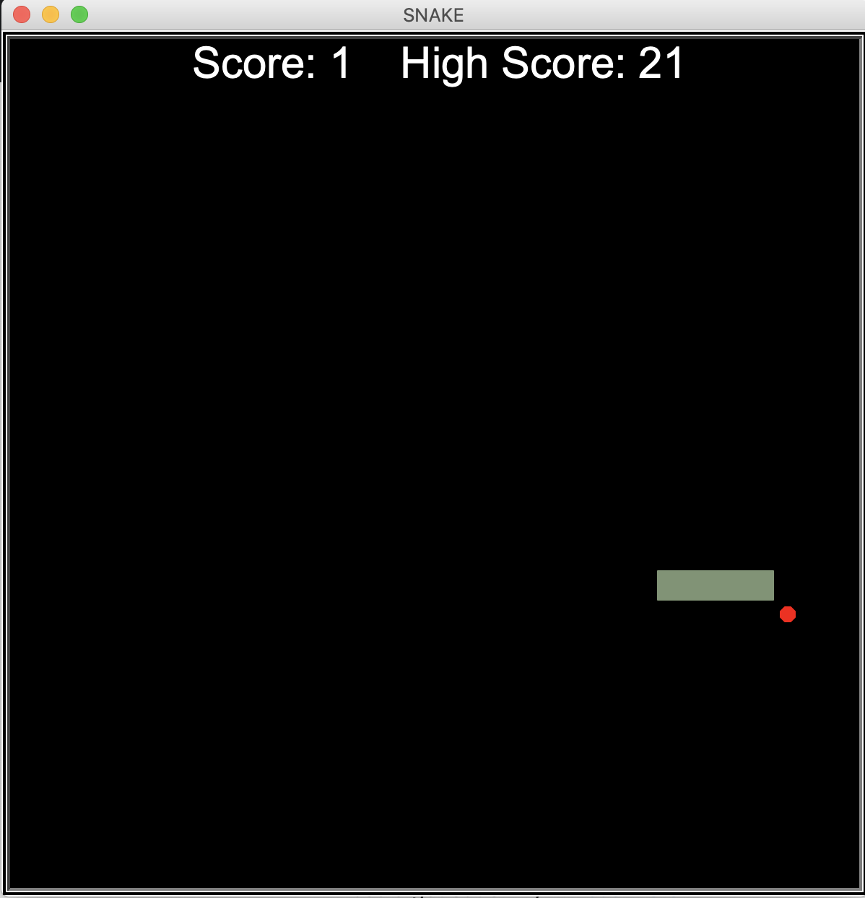
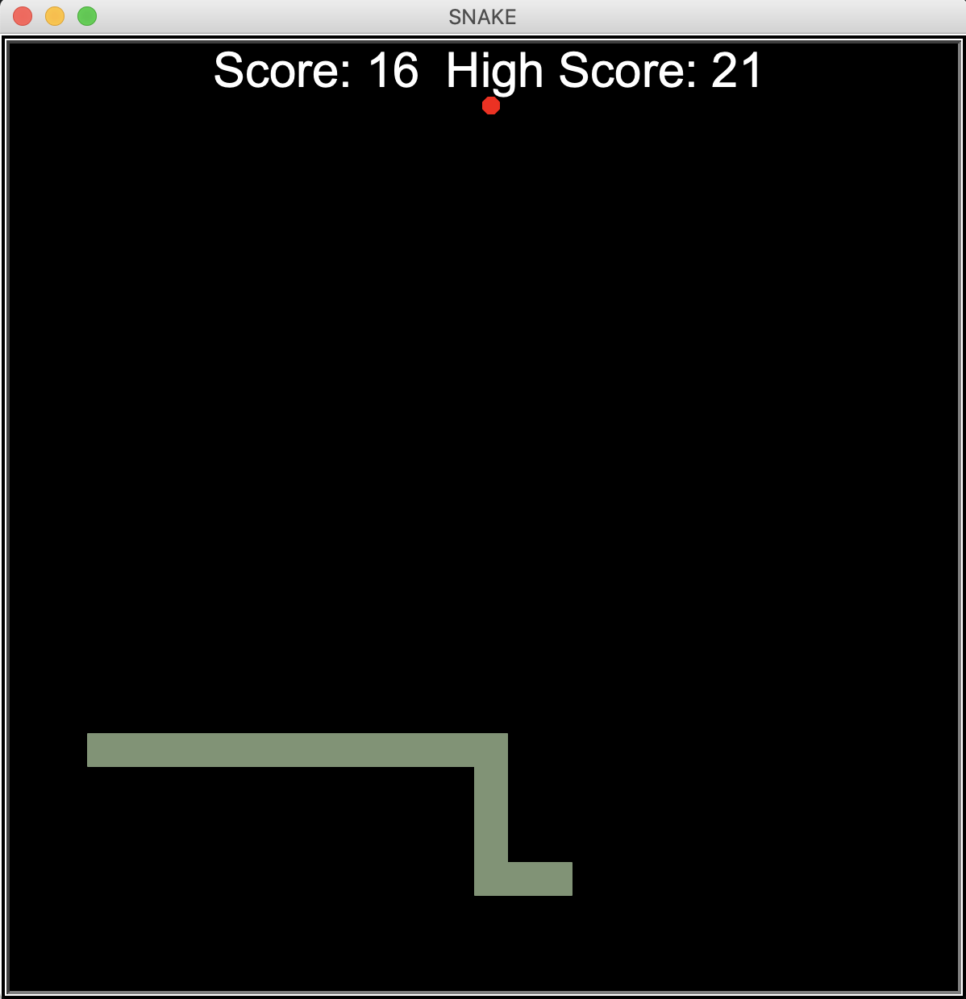

# snake_game :snake:

This project is a recreation of a classic snake game using turtle graphics.

Seen below is the snake on level 1. The snake constantly moves in the direction of its head, and can be turned using the arrow keys.
The goal of the game is to eat as many apples (red dots) as possible without hitting the walls or the snake itslef.
The score is displayed on the top-left and the highest score achieved so far is on the top-right.

Enjoy the game! 

​

​
